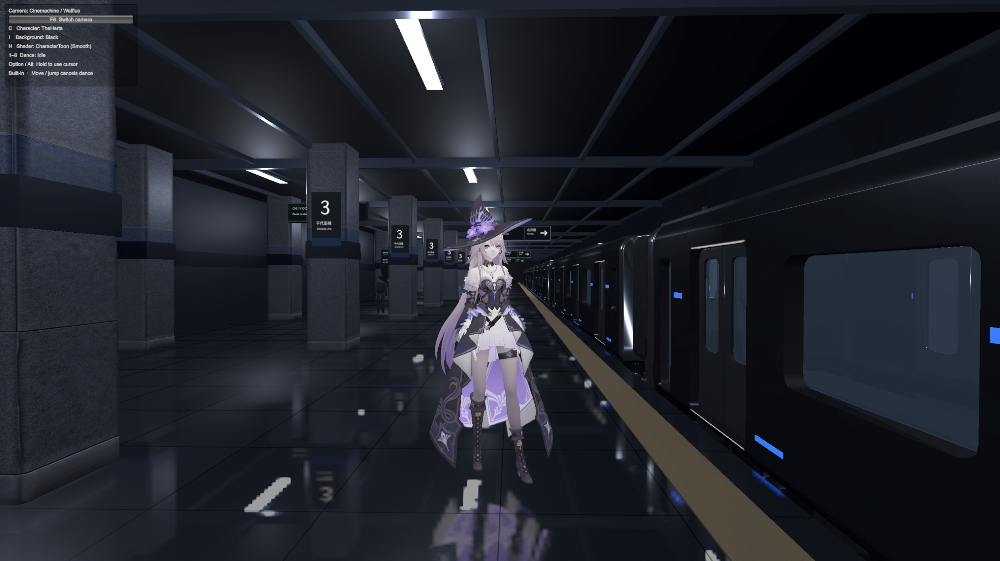
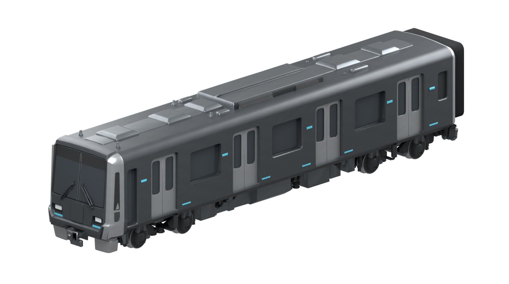
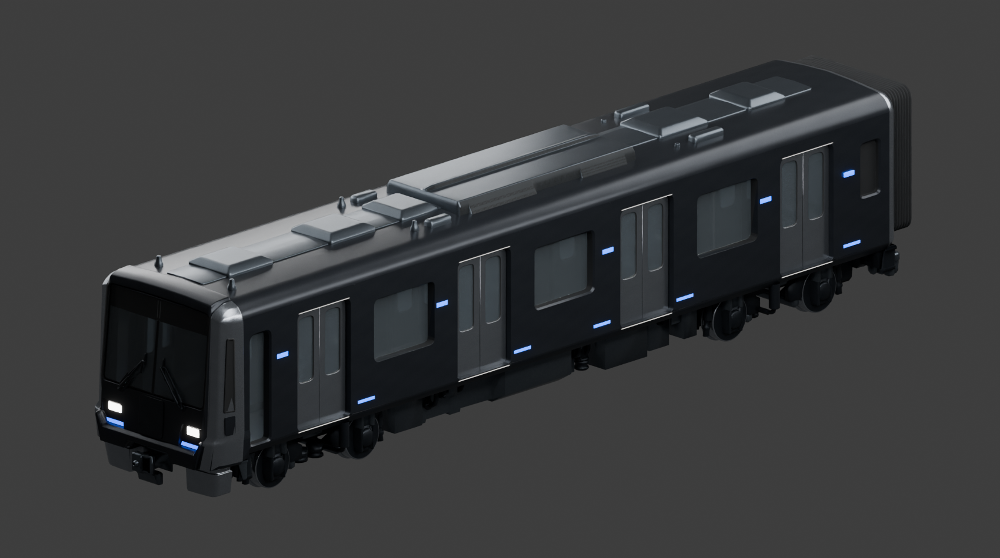

# STAFF - Unity Engine
[기획서 · STAFF (Notion)](https://app.notion.com/p/STAFF-3ce0c92994a080c99306d9338c436406?source=copy_link)

**미지수에 침식된 영혼을, 진리로 해방하는 사람들의 이야기.**

STAFF는 수학적 개념을 초월적 능력으로 표현하는 캐릭터 중심의 3D 액션 게임을 개발하는 프로젝트입니다. 자신의 한계를 마주한 주인공 한율이 스승 슈아를 만나, 두려움에 잠식되는 사람들을 구하며 자신이 알던 세계 너머로 나아갑니다.

수학은 능력의 형태와 가능성, 전투의 연출을 만드는 언어입니다. 이야기의 중심에는 인물의 성장과 관계가 있습니다. 처음에는 매력적인 인물과 서로 다른 능력을 알아가는 재미로 시작하고, 점차 진리와 두려움, 믿음과 희생을 둘러싼 질문으로 확장합니다.

## 세계관

### 미지수와 침식

사람들은 자신이 어디에서 왔고 어디로 향하는지, 자신의 선택이 어떤 결과로 돌아올지 알지 못합니다. 입시와 취업, 사랑과 생존까지 일상에는 수많은 미지수가 존재합니다.

이 세계에서 인간을 침식하는 것은 **미지수에 대한 두려움**입니다. 두려움이 클수록 적의 위력도 강해집니다. 적을 가리키는 **Arithmos**는 현재 가칭입니다.

미지수에 대한 두려움이 커질수록 인간은 영혼의 생기와 자아를 잃고 침식되어 갑니다.


### Axiom — 가능성을 현실로 빌려오는 힘

> Physics describes what is. Mathematics explores what can be.

수학은 보이지 않는 것에 형태를 부여하고, 아직 알 수 없는 것을 정의하고 증명하는 언어입니다. 이 세계의 인류는 0과 음수, 무리수와 허수처럼 한때 보이지 않던 개념들을 정의하며 세계의 진리에 접근해 왔습니다.

**Axiom**은 보이지 않는 무한한 가능성의 영역에서 초월적 현상을 물리적 세계로 빌려오는 능력입니다. 각 인물은 자신만의 수학적 개념을 통해 이 힘을 드러냅니다. Axiom은 개념과 명칭이 모두 확정된 설정입니다.

### Theorem & Definition — 능력이 기술이 되는 방식

Axiom이 원천적인 에너지에 가까운 능력이라면, **Theorem**은 그 힘을 자신만의 시각화된 기술로 구체화한 것입니다. **Definition**은 영역 전개에 해당하는 초월적 필살기로 구상하고 있으며, **Domain Extension**과 연결됩니다.

Theorem과 Definition은 **명칭은 확정됐지만 세부 개념은 설계 중**입니다. 반전 계열은 Counterexample / Contradiction / Paradox 중에서 검토하고 있으며, Hypothesis 역시 추가 가능성을 탐색하는 아이디어입니다.

### STAFF — 델타와 엡실론

STAFF는 Axiom을 가진 사람들이 모인 집단입니다. 이들의 목적은 **미지수에 침식된 영혼을 진리로 해방하는 것**입니다.

구성원들은 자신의 Theorem이 깃든 지팡이, **staff**를 지닙니다. 지팡이는 불가능해 보이는 경계를 다루는 도구이자 각자의 능력을 드러내는 무기입니다.

조직은 **델타(Delta)**와 **엡실론(Epsilon)**의 관계로 이루어집니다.

- **델타**: 멘토이자 목자, 스승. 엡실론을 보호하고 가르치는 존재입니다.
- **엡실론**: 멘티이자 양, 제자. 델타와의 관계 속에서 배우고 성장합니다.

극한의 엡실론–델타 논법에서 가져온 관계의 모티프는, 어떤 엡실론에게도 그를 품고 응답하는 델타가 있다는 것입니다. 이 보호와 가르침의 관계가 STAFF의 조직과 인물 서사를 함께 이끕니다.

### RNA — 진리를 탐구하는 엘리트 기관

**RNA(Radics National Academy)**는 세계의 근간을 이루는 진리를 밝히기 위해 존재하는 최고 수준의 교육 기관입니다. 누구나 들어갈 수 없는 이 기관은 진리에 접근하는 길인 동시에, 그 문턱을 넘으려는 사람들에게 또 다른 미지와 두려움의 원인이 됩니다.

<details>
<summary>세계관의 갈등 — Master Bible 스포일러</summary>

RNA는 진리에 접근할 자격을 소수에게만 허락하고, 돈과 권력에 따른 입시 부정과 이해관계에 따라 교육과 공개 범위를 바꿔 왔습니다. 진리를 밝히려는 기관이 오히려 진리를 독점하며 두려움을 키우는 모순이 세계관의 주요 갈등입니다.

</details>

## 인물과 이야기

| 인물 | Axiom | Theorem | 이야기 속 역할 |
| --- | --- | --- | --- |
| **한율** | 미분 | 뉴턴 | 교만과 자만심을 지녔던 주인공. 슈아와의 만남을 통해 자신이 모르는 세계를 인정하고 배워 나갑니다. |
| **슈아** | 적분 | 라이프니츠 | 세계관 최강자. 한율을 찾아 STAFF로 데려오고 그의 목자가 됩니다. 따뜻한 모습과 압도적인 힘을 함께 지닌 인물입니다. |

이야기는 한율이 주변 사람의 침식을 목격하며 절망하는 순간, 슈아를 만나는 데서 시작합니다. STAFF에 들어온 한율은 동료들의 서로 다른 능력을 알아가고, 훈련과 실전을 통해 자신의 가능성을 발견합니다.

Story Bible은 다음과 같은 확장을 구상하고 있습니다.

- **Season 1** $[\div 0]$ — **Obelus Meden**: STAFF와 슈아를 알아가는 과정, 동료들의 능력, 한율의 성장에 집중합니다. 미적분·대수(다항함수·지수로그함수·삼각함수)·수열·정수론이 주요 능력 소재입니다.
- **Season 2** $[\pi]$ — **Bibliotheca Pi**: 기하학을 사용하는 새로운 계통과 집단이 등장하며, 집합과 명제·기하학·확률과 통계로 능력의 범위가 넓어집니다. 슈아의 가족과 세계의 기원에 관한 이야기도 깊어집니다.
- **Season 3** $[i]$ — **Domain Extension**: 복소해석학·선형대수학·다변수/벡터 미적분학·미분방정식으로 확장합니다. 배반과 대립 속에서 자신이 따르던 신의 선함을 의심하고, 희생을 통해 믿음과 사랑의 의미를 마주하는 이야기입니다.

전투 구상에는 순간의 변화율을 읽는 미분, 흩어진 힘을 누적하는 적분, 수열과 함수의 성질을 활용한 공격과 회피 등이 있습니다. 이는 설계 문서의 아이디어이며, 현재 모두 구현된 기능을 뜻하지는 않습니다.


## 개발 현황

Unity에서의 실제 플레이 화면입니다.



현재 지하철 씬에서는 사람 크기에 맞춘 에셋 배치, 캐릭터 이동·점프·대시, 추적 카메라, 캐릭터 교체와 충돌을 확인할 수 있습니다. 열차·기둥·안내판을 반복 배치하고, 청색 발광과 실시간 바닥 반사를 적용했습니다.

화면의 **더 헤르타**는 구현 확인용 캐릭터이며, STAFF의 이야기 속 한율·슈아와는 별개입니다. 스크린샷은 **CharacterToon (Smooth)** 셰이더가 적용된 상태입니다.

환경은 두 가지 셰이더 표현(Real, Abstract)을 지원하는 방향으로 개발할 예정이며, 캐릭터 셰이더는 환경 전환의 영향을 받지 않도록 분리합니다. 현재는 지하철 배치와 조작을 확인하는 단계로, 환경 모드 전환·열차 문 상호작용·반사 품질 및 성능 개선은 후속 작업입니다.

## Tripo & Astra 3D 생성 파이프라인

이미지에서 형태를 정하고, Quad 메시 생성과 편집, UV·텍스처 작업을 거쳐 Unity 씬으로 가져오는 프로젝트 제작 흐름입니다. 아래 모델명과 생성 기준은 이 프로젝트의 작업 기준을 나타냅니다.

지하철은 **Tripo 3D 에셋 생성(Quad 기준) → GPT 6 Astra UV Mapping → Texturing → PBR 작업** 순서로 제작했습니다. 먼저 텍스처 적용을 완료하고, 바로 이어서 GPT Astra로 PBR 재질·발광·유리 표현을 작업했습니다.

**예시 3D 모델 사진**



`Topology Textured` 단계의 원본 QA 렌더입니다.



기존 형상과 UV를 이어받아 금속성·거칠기·발광·유리 재질을 조정한 `PBR Glow` 단계의 원본 QA 렌더입니다. 두 이미지는 각 제작 단계의 기록이며, 조명과 배경도 다릅니다.

### 1. GPT 6.1 Image Generation

- **앞 / 좌 / 뒤 / 우** 네 방향의 이미지를 준비합니다. 대칭인 방향은 별도로 생성하지 않고, 재사용할 수 있는 이미지를 최대한 활용합니다.
- 각 방향에서 형상·비율·부품 위치가 일치하도록 기준을 맞춥니다.
- **빛 반사와 번짐 효과는 모두 제거하고, 투명한 유리는 반드시 불투명하게 처리합니다.** 메시 생성용 이미지에는 형태를 읽는 데 방해가 되는 반사·투과 효과를 넣지 않습니다.
- 유리와 발광의 최종 표현은 UV·텍스처·재질 단계에서 다시 적용합니다.

### 2. Tripo Smart Mesh (Quad) Creation

- 지하철은 **앞부분부터 생성**합니다. 이를 기준으로 재사용 가능한 토폴로지를 복사·편집하면 중앙 차량 부분을 구성할 수 있습니다.
- 이 프로젝트에서는 **Blender에서 편집하기 좋은 Quad 기반 메시**를 생성 기준으로 삼습니다.
- 프로젝트 작업 경험상 Tripo의 Smooth Rendering을 기준으로 Triad 방식은 디테일을 줄이며 보수적으로 생성되는 경향이 있어, Quad를 기반으로 디테일과 렌더링 형태를 함께 확인합니다.

| 복잡도 | Polygon 수 기준 |
| --- | ---: |
| Simple | 5,000 |
| Normal | 10,000 |
| Complex | 15,000 |

### 3. GPT 6 Astra 3D Edit

**반드시 Quad Topology를 유지하고, 결과는 Tripo 특유의 Smooth Rendering을 기준으로 확인합니다.**

편집 요청에는 다음 기준을 함께 전달합니다.

```text
- 요청 부위만 최소 수정하고 원본의 형상·치수·위치·디테일을 유지해줘.
- 원본 Edge Flow를 보존하고, Blender에서 편집하기 좋은 Quad 기반 Topology로 작업해줘.
- Tripo Smooth Rendering을 기준으로 평면이 울거나 꺼지지 않도록 필요한 지지 루프·베벨을 배치해줘. Custom Normal에만 의존하지 마.
- 불필요한 삼각 분할·긴 삼각형·겹친 면을 피하고, 면 방향과 연결 상태를 확인해줘.
- 원본의 FB_ngon_encoding 등 사각 면 정보를 보존하고, FBX와 GLB와 Quad 편집용 .blend를 함께 제공해줘.
- 내보낸 파일을 다시 불러와 Smooth와 Wireframe을 검증해줘.
```

재사용 가능한 부위를 컴포넌트로 분리했다면 원점·축·치수와 조립 위치를 함께 관리합니다. 원본을 남기고, 다른 모듈에도 반복해서 사용할 수 있도록 부품 경계를 정리합니다.

- **Tripo에서 Wireframe까지 확인할 때는 FBX / OBJ로 내보내는 것을 프로젝트 기준으로 삼습니다.**
- **Tripo에서 GLB를 사용하는 세부 기준은 추가 정리 예정입니다.**
- 현재 지하철 에셋은 `.blend` 편집 원본과 FBX·GLB 교환 파일을 함께 관리합니다. 일반 GLB importer는 `FB_ngon_encoding`을 해석하지 않으면 삼각형으로 표시할 수 있으므로, 파일을 다시 불러온 뒤 사각 면 정보와 실제 연결 상태를 확인합니다.

### 4. GPT 6 Astra UV Mapping & Texturing

**이 단계는 UV·텍스처 작업 후, 곧바로 GPT 6 Astra를 통한 PBR 작업으로 이어집니다.** 지하철의 `Topology Textured` 버전을 먼저 완성한 다음, 원본 형상과 UV를 유지하며 `PBR Glow` 버전을 제작했습니다.

- 확정한 형상과 Quad Topology를 유지하며 UV를 정리합니다. UV 겹침과 왜곡을 검사하고, 재사용 부품의 텍스처 배치를 일관되게 맞춥니다.
- Base Color / Roughness / Metallic / Emission 등 재질 정보를 분리합니다. 메시 생성용 이미지에서 제외했던 발광과 유리 표현은 이 단계에서 재질로 설정합니다.
- 지하철 에셋은 차체·문에 4K, 하부 장치에 2K 텍스처를 사용합니다. Base Color와 Emission은 sRGB, ORM은 Non-Color 데이터로 관리합니다.
- ORM의 G는 Roughness, B는 Metallic입니다. Unity Built-in 재질에 연결할 때는 Roughness를 Smoothness로 변환합니다.
- BLEND·GLB·FBX의 재질 지원 차이를 확인합니다. 현재 FBX 유리는 호환용 투명도를 사용하며, Blender의 물리적 투과·굴절과 동일한 결과로 간주하지 않습니다.
- 최종 파일을 재수입해 UV·텍스처 연결·발광·유리·Smooth 렌더링을 검증합니다.

### 5. GPT 6 Astra Scene Creation

- Unity에 가져온 에셋은 **사람 크기와 1 unit = 1m**를 기준으로 크기와 비율을 맞춥니다. 원본 모델을 보존하고 배치용 부모 오브젝트에서 정규화합니다.
- 레퍼런스의 카메라 구도, 공간의 깊이, 반복 구조를 먼저 맞춥니다. 부족한 구조물은 Greybox로 채운 뒤 필요한 에셋으로 교체합니다.
- 재사용 부품을 조립하고 바닥·기둥·열차 등에 충돌을 설정합니다. 조명·발광·반사는 실제 플레이 카메라에서 확인합니다.
- 기존 캐릭터·이동·카메라 시스템을 연결하고, 캐릭터 재질은 환경 표현과 별도로 유지합니다.
- 실제 Play 모드에서 이동과 충돌을 검증하고, 구현 화면을 기록합니다.

원본 지하철 에셋: `../STAFF/3D Studio/Tripo/Subway/PBR Glow/`  
Unity 모델: `Assets/StaffSubway/Models/Train/TrainPBRGlow.fbx`  
[씬 구성·스케일·에셋 상세](Assets/StaffSubway/Documentation/README.md)

## 실행과 조작

### 1. Unity Hub와 Unity Editor 설치

1. [Unity 공식 다운로드 페이지](https://unity.com/download)에서 운영체제에 맞는 **Unity Hub**를 설치하고 Unity 계정으로 로그인합니다. Hub의 안내에 따라 사용할 라이선스를 활성화합니다.
2. [Unity 6000.3.11f1 공식 배포 페이지](https://unity.com/releases/editor/whats-new/6000.3.11f1)의 **Install** 버튼으로 Hub를 열어 해당 Editor를 설치합니다. Apple Silicon Mac은 ARM64 버전을 선택합니다.
3. Hub의 **Installs** 목록에 `6000.3.11f1`이 표시되는지 확인합니다. 이 프로젝트의 기준 버전은 `ProjectSettings/ProjectVersion.txt`에 기록되어 있습니다.

### 2. Git으로 프로젝트 받기

Git을 설치한 뒤 터미널에서 프로젝트를 보관할 폴더로 이동해 실행합니다.

```bash
git clone https://github.com/overjoy1008/STAFF-Engine.git
cd STAFF-Engine
```

복제된 `STAFF-Engine` 폴더 안에 `Assets`, `Packages`, `ProjectSettings`가 있어야 합니다. 이 세 폴더를 포함하는 **저장소 최상위 폴더**가 Unity 프로젝트입니다.

### 3. 첫 실행 전 Tripo Bridge 경로 확인

현재 `Packages/manifest.json`의 `com.tripo3d.unitybridge`는 제작 PC의 로컬 폴더를 참조합니다. 다른 PC에서는 이 경로가 없으므로, Unity를 열기 전에 사용 방식에 맞춰 처리합니다.

- **기존 씬을 실행할 때**: `Packages/manifest.json`에서 `com.tripo3d.unitybridge` 항목 한 줄을 제거하고 저장합니다. JSON의 쉼표 형식은 유지합니다. 씬에 가져온 모델은 `Assets`에 있으므로 Tripo 연결 없이 사용할 수 있습니다.
- **Tripo Bridge도 사용할 때**: Bridge를 준비한 뒤 해당 항목의 `file:` 경로를 자신의 설치 폴더에 맞춥니다.

패키지 잠금 파일은 Unity가 의존성을 다시 해결하면서 갱신합니다.

### 4. Unity Hub에 등록하고 열기

1. Unity Hub의 **Projects → Add → Add project from disk**를 선택합니다.
2. 위에서 복제한 **`STAFF-Engine` 폴더 자체**를 선택합니다. `Assets` 폴더나 개별 `.unity` 파일을 선택하지 않습니다.
3. Projects 목록에 추가된 프로젝트의 Editor 버전이 **6000.3.11f1**인지 확인하고 프로젝트를 엽니다. 버전이 설치되지 않았다는 안내가 나오면 해당 버전을 설치합니다.
4. 첫 실행에서는 패키지 다운로드, 에셋 임포트와 셰이더 컴파일이 끝날 때까지 기다립니다. `Library` 등 작업용 캐시는 Unity가 생성합니다.

Hub에는 복제한 로컬 폴더가 등록되며, Git 원격 저장소 연결은 `git clone`에서 이미 설정됩니다. 이후 업데이트는 같은 폴더에서 Git으로 관리하고, Hub에서는 등록된 프로젝트를 열면 됩니다. [Unity Hub 프로젝트 등록 안내](https://docs.unity.com/en-us/hub/project-manage)

### 5. 씬 실행과 조작

Unity의 **Project** 창에서 `Assets/Scenes/STAFF_Subway_Reference.unity`를 더블클릭하고 상단 **Play** 버튼을 누릅니다. **Game** 화면을 클릭하면 캐릭터를 조작할 수 있습니다. 기본 캐릭터·이동 테스트 씬은 `Assets/Scenes/SampleScene.unity`입니다.

| 입력 | 동작 |
| --- | --- |
| WASD / Ctrl | 이동 / 걷기 |
| Space | 점프 |
| Shift 또는 마우스 우클릭 | 대시 |
| 마우스 / 휠 / 가운데 버튼 | 시점 회전 / 줌 / 시점 정렬 |
| C | 캐릭터 선택 |
| H / F6 | 캐릭터 셰이더 / 카메라 방식 전환 |
| Esc / 마우스 좌클릭 | 커서 해제 / 다시 잡기 |
